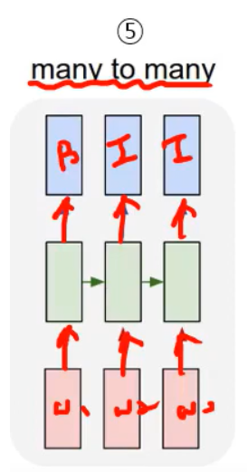

# 5. ANN for Language Model: PART 1

##### Recurrent Neural Network (RNN)

- ##### 순환 신경망

  - **은닉 노드(node)**가 방향을 가진 **엣지(edge)**로 연결되어 순환 구조를 이루는 인공신경망의 한 종류

  - 음성이나 문자와 같이 **시간 축을 따라서 순차적으로 등장하는 데이터 처리에 적합**함

  - ##### 장점

    - 입출력 길이가 자유로움
    - 필요에 따라 다양하고 유연하게 구조를 만들 수 있음

  - **대표적인 ANN**

    - ##### Multi-layer perceptron(MLP)

    - ##### CNN

      - 이미지에서 좋은 성능을 가짐

    - ##### RNN

      - 좋은 성능을 내는 모델 **Transformer**

- ##### FNN VS RNN

  

  - **FNN**과 **RNN**의 차이점은
    - **h**식을 만들 때 **UH(t-1)**만 추가 해준 것
      - **h(t)의 전 값인 h(t-1)**을 추가해주고 거기에 **U**를 곱하여 더 해줌

- ##### RNN 기본 구조

  - ##### Folding

    

    - 시간 축을 고려하지 않고 그림을 그려본 것

    - **입력x(t)**이 있고 그 다음에 **weight(W(xh))**를 곱하고 **bias(b(h))**를 더하는  **linear function**에 **h(t-1) 상태의 weight**를 곱해줌

    - 여기서 **nonlinear function**으로 **하이퍼탄젠트(tanh)**를 사용

      - **하이퍼탄젠트(tanh)**는 **-1 ~ 1** 사이의 값을 내뱉는 함수

      

      - 그래프로는 위와 같이 그림

  - ##### Unfolding

    

    - 시간 축을 따라서 **weight** 값을 한번에 공유된 가중치를 **Update**
    - 맨 끝에 **error**가 나오면 역방향으로 다시 **Update**
      - 공유된 **weight**가 계속 업데이트됨
    - 역전파를 진행할 때 **MLP**같은 경우는 각각의  **weight**가 다르지만 **RNN**은 모두 공유됨
    - 그림에 있는 모든 **weight**는 공유되는 것

  - 기본적으로 **RNN**은 **Folding**구조

  - **Unfolding** 구조만 보고 **weight**값이 각각으로 가지고 있다고 착각하면 안됨

    - **weight**는 하나임

- ##### RNN 응용 구조

  - ##### One to One

    

    - 일반적인 NN ( FNN과 유사 )
      - **입력**, **출력**, **recurrent** 구조로 작동 됨

  - ##### One to Many

    

    - 입력은 하나, 출력은 여러개
    - 대표적인 응용으론 **자막 생성 (image captioning)**

  - ##### Many to one

    

    - 분류 및 예측 (prediction )
    - 입력이 여러개고 하나의 출력을 내뱉음
    - **classification (분류)**은 **MLP, CNN **으로 풀어도 되지만
      - 시간 축에 따라 들어오는 데이터의 특성을 잘 반영해야하는 문제이면 해당 방법을 이용
      - **MLP**는 시간축에 따라서 들어온 순서를 알 수가없음
      - **CNN**도 구조적으로 어느 위치에 있는 지는 알 수 있지만 시간축에 대한 정보는 알 수 없음
      - 즉, 시간축에 따른 정보를 바탕을 사용해야 한다면, **Many to One**의 구조를 사용

  - ##### Many to Many

    

    - 입력, 출력 둘다 여러개
    - 다른 말로, **sequence to sequence**
    - 대표적인 예시로, **기계 번역**

  - ##### Many to Many 2

    

    

    - ##### 순차 표지 부착

      - 입력 데이터가 **순차적인 특성(시간적 또는 문맥적 관계)**을 가지며, 각 입력 요소마다 개별적인 레이블을 예측하는 문제
      - 예를 들어, 문장의 각 단어에 대해 품사를 예측하는 **품사 태깅(Part-of-Speech Tagging)**, 개체명을 식별하는 **Named Entity Recognition (NER)**, 또는 유전자 서열 분석 같은 문제에 적용

