# 5. ANN for Language Model: PART 1

##### Recurrent Neural Network (RNN)

- ##### 순환 신경망

  - **은닉 노드(node)**가 방향을 가진 **엣지(edge)**로 연결되어 순환 구조를 이루는 인공신경망의 한 종류

  - 음성이나 문자와 같이 **시간 축을 따라서 순차적으로 등장하는 데이터 처리에 적합**함

  - ##### 장점

    - 입출력 길이가 자유로움
    - 필요에 따라 다양하고 유연하게 구조를 만들 수 있음

  - **대표적인 ANN**

    - ##### Multi-layer perceptron(MLP)

    - ##### CNN

      - 이미지에서 좋은 성능을 가짐

    - ##### RNN

      - 좋은 성능을 내는 모델 **Transformer**

- ##### FNN VS RNN

  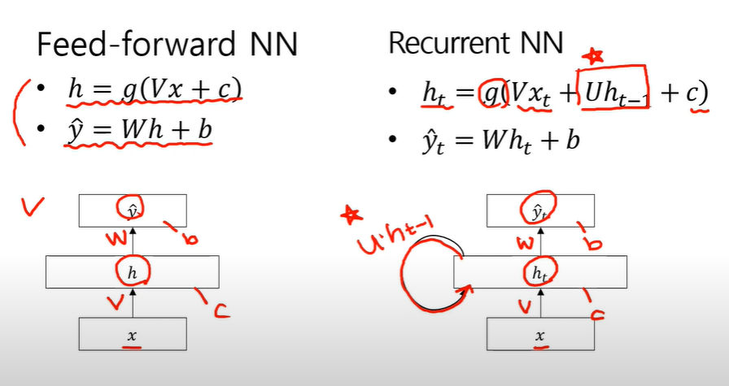

  - **FNN**과 **RNN**의 차이점은
    - **h**식을 만들 때 **UH(t-1)**만 추가 해준 것
      - **h(t)의 전 값인 h(t-1)**을 추가해주고 거기에 **U**를 곱하여 더 해줌

- ##### RNN 기본 구조

  - ##### Folding

    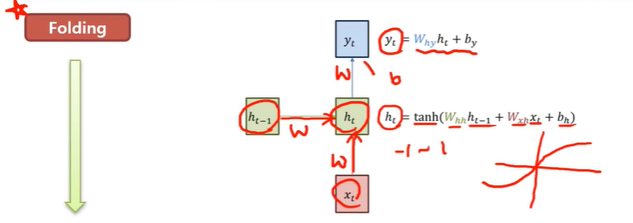

    - 시간 축을 고려하지 않고 그림을 그려본 것

    - **입력x(t)**이 있고 그 다음에 **weight(W(xh))**를 곱하고 **bias(b(h))**를 더하는  **linear function**에 **h(t-1) 상태의 weight**를 곱해줌

    - 여기서 **nonlinear function**으로 **하이퍼탄젠트(tanh)**를 사용

      - **하이퍼탄젠트(tanh)**는 **-1 ~ 1** 사이의 값을 내뱉는 함수

      

      - 그래프로는 위와 같이 그림

  - ##### Unfolding

    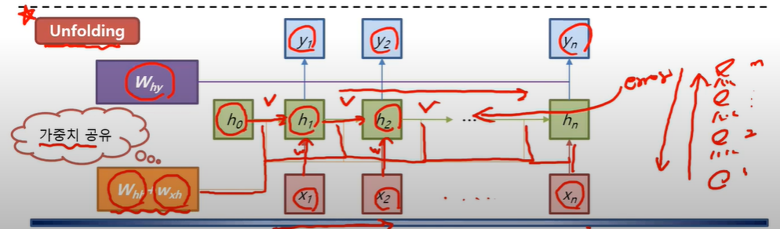

    - 시간 축을 따라서 **weight** 값을 한번에 공유된 가중치를 **Update**
    - 맨 끝에 **error**가 나오면 역방향으로 다시 **Update**
      - 공유된 **weight**가 계속 업데이트됨
    - 역전파를 진행할 때 **MLP**같은 경우는 각각의  **weight**가 다르지만 **RNN**은 모두 공유됨
    - 그림에 있는 모든 **weight**는 공유되는 것

  - 기본적으로 **RNN**은 **Folding**구조

  - **Unfolding** 구조만 보고 **weight**값이 각각으로 가지고 있다고 착각하면 안됨

    - **weight**는 하나임

- ##### RNN 응용 구조

  - ##### One to One

    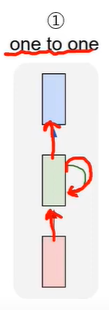

    - 일반적인 NN ( FNN과 유사 )
      - **입력**, **출력**, **recurrent** 구조로 작동 됨

  - ##### One to Many

    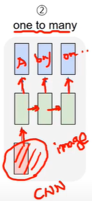

    - 입력은 하나, 출력은 여러개
    - 대표적인 응용으론 **자막 생성 (image captioning)**

  - ##### Many to one

    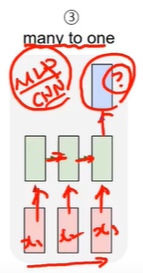

    - **분류 및 예측 (prediction)**
      - **classification** 혹은 **regression** 문제에 적합
    - 입력이 여러개고 하나의 출력을 내뱉음
    - **classification (분류)**은 **MLP, CNN **으로 풀어도 되지만
      - 시간 축에 따라 들어오는 데이터의 특성을 잘 반영해야하는 문제이면 해당 방법을 이용
      - **MLP**는 시간축에 따라서 들어온 순서를 알 수가없음
      - **CNN**도 구조적으로 어느 위치에 있는 지는 알 수 있지만 시간축에 대한 정보는 알 수 없음
      - 즉, 시간축에 따른 정보를 바탕을 사용해야 한다면, **Many to One**의 구조를 사용
  
  - ##### Many to Many
  
    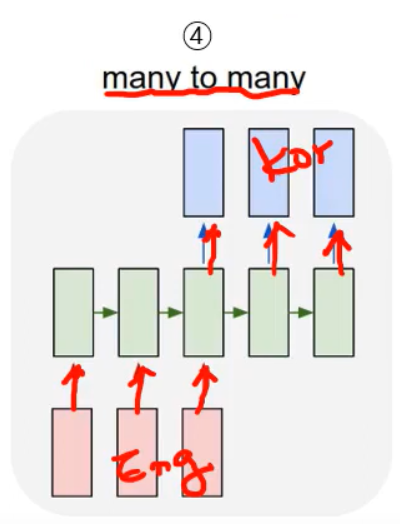
  
    - 입력, 출력 둘다 여러개
    - 다른 말로, **sequence to sequence**
    - 대표적인 예시로, **기계 번역**
  
  - ##### Many to Many 2
  
    
  
    - ##### 순차 표지 부착
  
      - 입력 데이터가 **순차적인 특성(시간적 또는 문맥적 관계)**을 가지며, 각 입력 요소마다 개별적인 레이블을 예측하는 문제
    - 예를 들어, 문장의 각 단어에 대해 품사를 예측하는 **품사 태깅(Part-of-Speech Tagging)**, 개체명을 식별하는 **Named Entity Recognition (NER)**, 또는 유전자 서열 분석 같은 문제에 적용

- ##### From Vanilla RNN to LSTM

  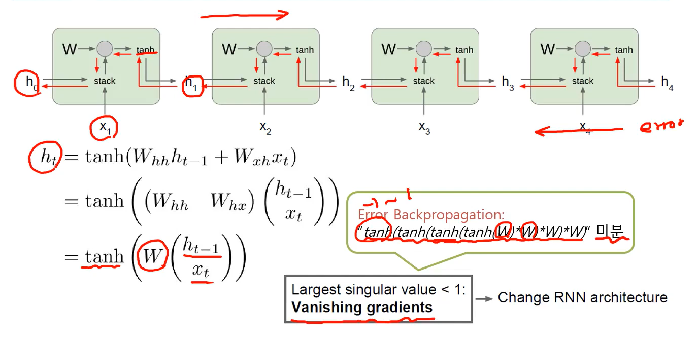

  - **RNN**은 다양한 구조로 변형이 가능해서 여러 문제에 적용할 수 있는 **장점**이 있음

  - 하지만, 초기에 디자인 했던 **RNN** 은 **단점**도 있음

    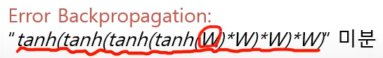

    -  계속해서 미분하기 때문에 **-1 ~ 1** 값을 계속 곱해서 **error**가 앞쪽으로 **propagation**이 되는데 여기서 **기울기 소실 문제**가 발생됨 
    - 자세히 풀어서 설명하면, 
    - **역전파 과정**에서 **시간 축**을 따라 **기울기**가 연속적으로 곱해지기 때문에, **특정 활성화 함수(예: 시그모이드, 하이퍼볼릭 탄젠트)**에서는 **기울기**가 **매우 작아지거나(Vanishing Gradient) 지나치게 커지는(Exploding Gradient) 문제**가 발생

  - 해당 문제 때문에 **LSTM**으로 구조를 바꿔서 사용

- ##### Long Short-Term Memory (LSTM)

  - 기울기 소실 문제 해결 가능

    - 비슷한 구조를 가진 **GRU** 가 있음

    - ##### GRU

      - 게이트 함수를 줄여서 사용하는 것
      - 게이트 함수를 줄여서 학습 속도를 높임

  - **Short-Term Memory**를 길게 유지 시키겠다는 의미

  - **게이트**라는 개념을 도입

    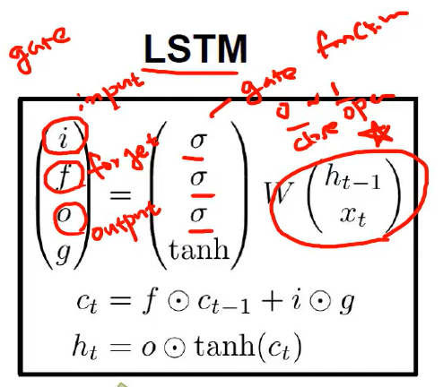

  - 게이트에 의해서 유지해야할 것은 유지하고 잊어버려야 할 것은 잊게 만드는 것

  - **i** : input gate
    - 입력을 할지말지 정하는 함수
    - 무조건 입력을 반영하는 것이 아님 

  - 시간 축에 따라서 노이즈는 제거할 수도 있기 때문에 제거를 해야되니까 반영을 할지 말지는 상황보고 정할 수 있음
  - **f** : forget gate
    - 앞에서 히든으로 넘어오는 값을 context를 여기서 잊을지 말지 정하는 함수

  - **o** : output gate
    - 해당 시점에서 출력을 할지말지 정하는 함수
  - **g** : 기존의 **Vanilla RNN**이랑 같은
    - 그냥 `W` 수식에 **하이퍼탄젠트 (tanh)** 씌운거와 같음 

  - **게이트**의 유래는 그림에 보면 **시그모이드**를 씌운 함수가 있는데 이것을 **게이트 함수 (Gate Function)**이라고 함
    - 시그모이드의 특성인 `0 ~ 1`사이의 값을 활용해서 인데
      - `0`이면 **close**, `1`이면 **open** 으로 표현할 수 있기 때문

  - **Vanilla RNN**과 **LSTM**의 그림을 비교하면 **하이퍼탄젠트**를 씌우지 않은 식의 값은 같을 걸 알 수 있음

    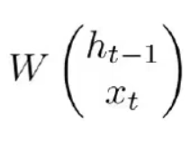
    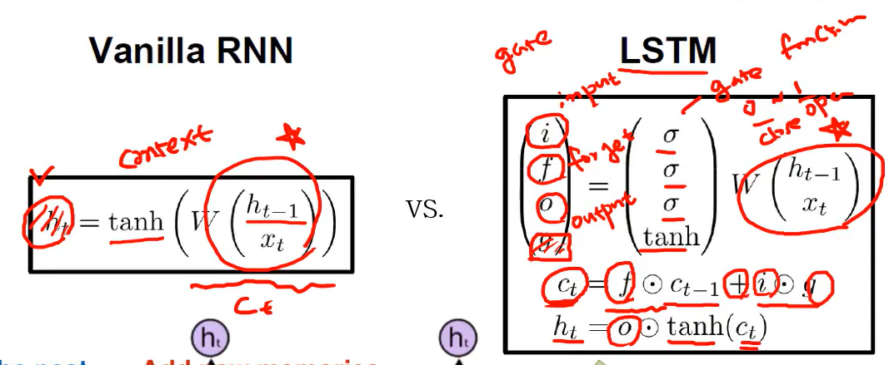

    - 여기서 **LSTM**의 **차이점**은 **3개의 게이트 (Input, forget, output)**을 통해서 컨트롤 하겠다는 것

    - 어떨 때는 Input, 어떨 때는  forget, 어떨 때는  output을 수행하게 하려는 것  

  - 여기서 게이트의 값은 우리가 정해주는 것이 아니고 자기가 알아서 조절되도록 학습하겠다 하는 것

  - 작동 원리

    - c(t) -> 컨텍스 

    - **c(t) = forget gate * c(t-1) + input gate * g**
      - 이전 값을 받을 건지 말건지 + 지금 입력을 받을 건지 말건지
      - 이 두개의 값을 합쳐서 **c(t)**를 만듦

    - 이렇게 만들어진 **c(t)**를 활용하여 **output**을 만들어서 **h(t)**를 갱신
      - 만들어진 **c(t)**에 **하이퍼탄젠트**를 씌움 
      - **h(t) = output * tanh(c(t))**

    - 위 과정들이 **LSTM**의 기본 구조

      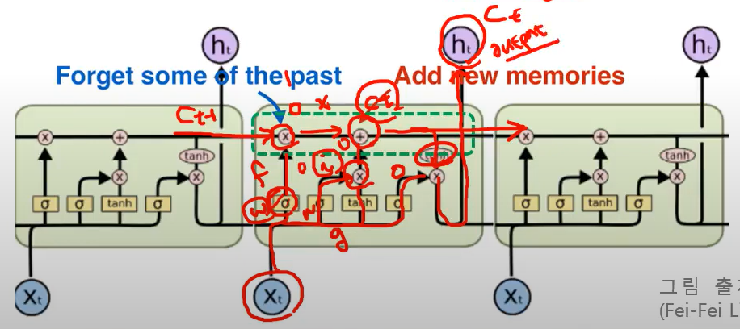

  - 기울기 소실 문제가 해결되는 이유
    - **c(t)**를 기준으로 **weight**가 곱해지면서 뒤로 쭉 가는데 그 값을 미분해서 역전파를 해야되는데 미분할 때 `+`가 있어서 각각 **error**값들이 곱해지는 게 아닌 더해지면서 기울기가 살아남아서 앞쪽으로 전달됨

  - ##### LSTM 의 단점

    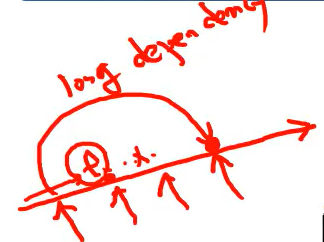

    - 학습을 하다보면 **앞의 정보가 필요할 때 (long depen dency)**가 있는데 **forget**으로 그 정보를 잊어 버리면 해당 정보를 알 수 있는 방법은 절대 없음
    - 이런 문제들을 못풀기 때문에 **짧게 짧게 기억 (Short-Term Memory)** 하는 문제에만 적합함

- ##### 실습 Many to One

  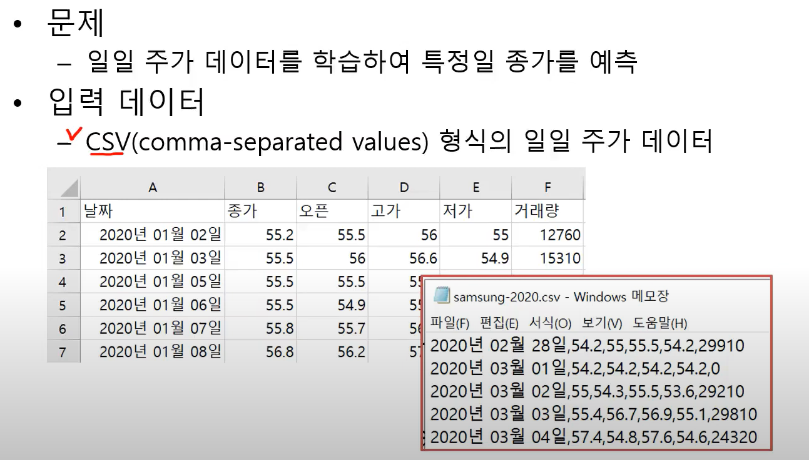

  - 오픈, 고가, 저가, 거래량을 바탕으로 종가를 예측하는 건데 당일의 값을 기준으로 당일의 종가를 예측하는 거면
    **MLP**, **CNN**을 사용하면 됨
  - 그러나, 며칠동안의 흐름을 보고 종가를 예측하는 것은 **RNN** 사용
  - 실습 코드

  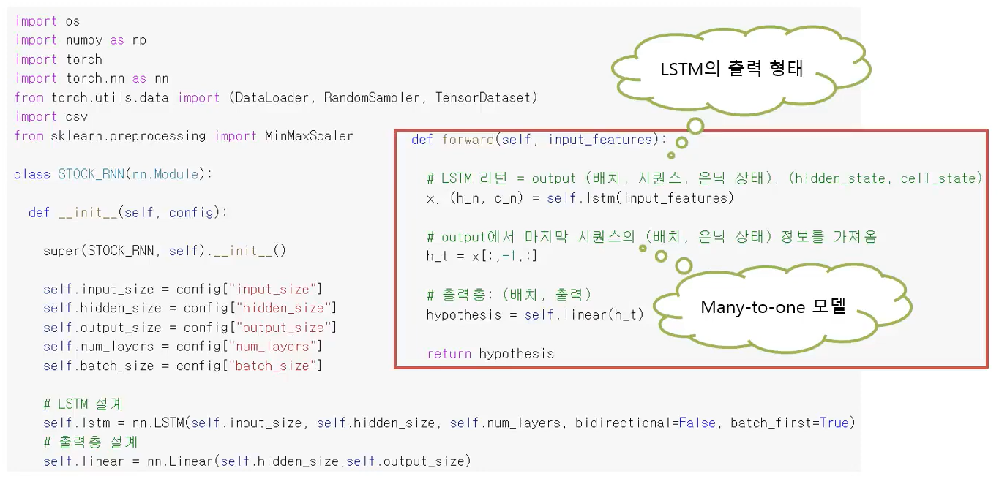

  - **num_layers**

    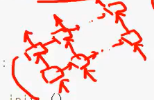

    - 그림은 두개의 **num_layers**임
    - 그림으로 설명하면 만약에 한 줄만 있으면 1개의 **num_layers**

  - ##### batch first

    - **true**일 경우 배치 순서대로 처리하는 것

  - ##### bidirectional

    - **false** 일 경우 정방향
    - **true** 일 경우에는 역방향으로 만들 수 있음
      - 정방향과 역방향 결과를 합쳐서 **output**을 내고 싶으면 **true**

  - 맨 마지막에 **Linear**를 씌워서 **Output**을 만듦

  - 다음으로 **forward** 함수에서 **Hyperthesis**를 만듬

    - `input_features`을 입력으로 받아서 `list`에 넣어줌
    - 여기서 `lstm`의 리턴 값이 특이함
    - **LSTM 리턴** 은 두개의 튜플을 가짐
      - `Output`을 가진 튜플 **(배치, 시퀸스, 은닉 상태)**
      - `hidden`과 `cell` `state`를 가진 튜플
      - hidden - > h(n) / cell = c(n)

  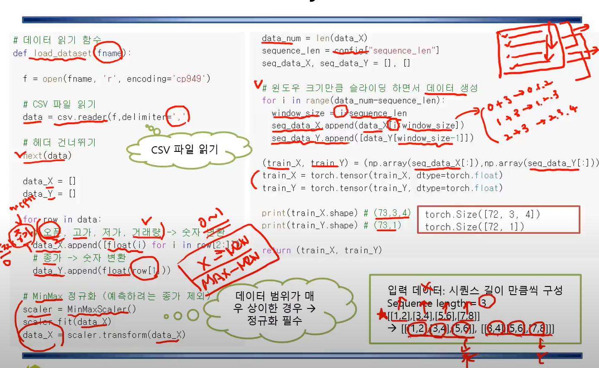

  - ##### MinMax 정규화

    - `X - MIN` / `MAX - MIN`
    - `0 ~ 1`의 값으로 만들어 버림
    - **MAX**값이 들어오면 `1`,  `MIN`값이 들어오면 `0`

  - **LSTM**에서는 입력 데이터가 자체가 시퀀스로 들어와야함

    - **앞의 n개 (시퀸스 길이)**를 바탕으로 `output`을 만들고
    - 그 다음에는 앞에서 한칸신 옆으로 가면서 계속해서 `output`을 만듬

  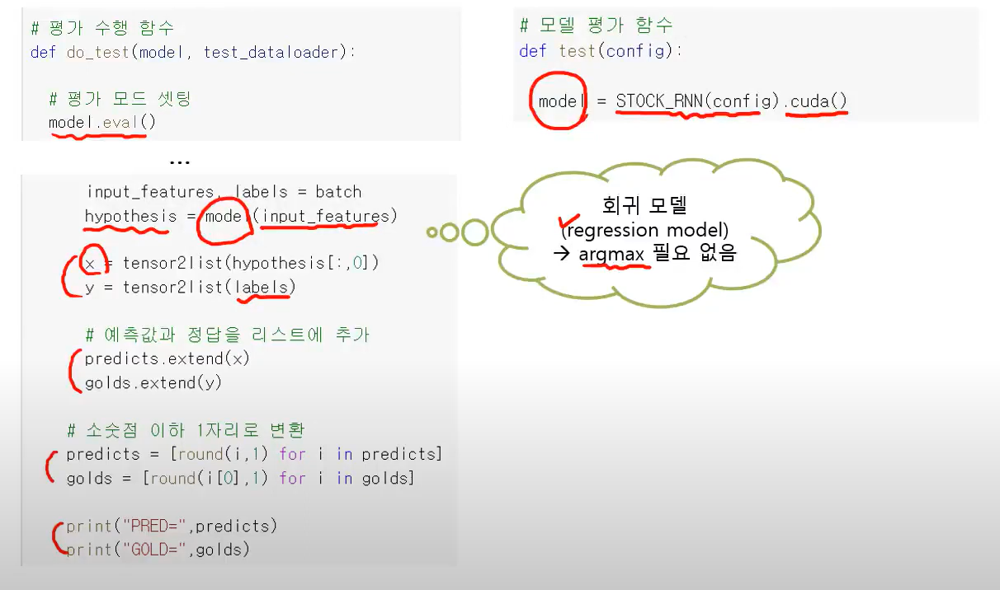

  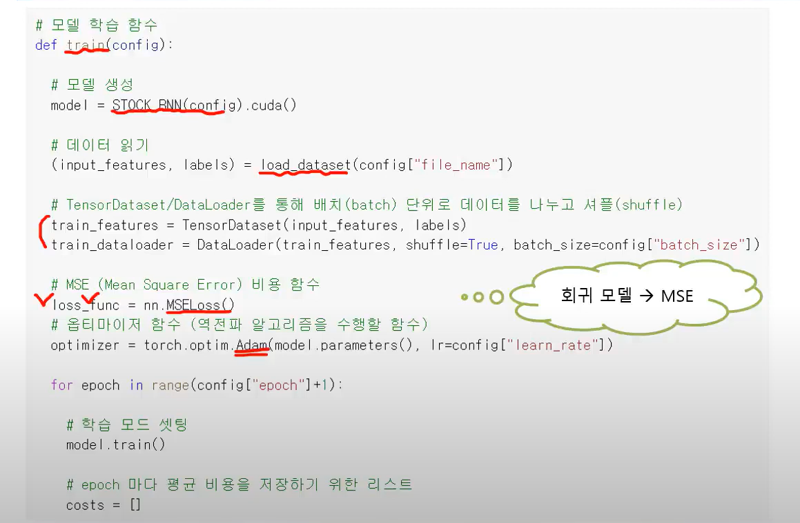

  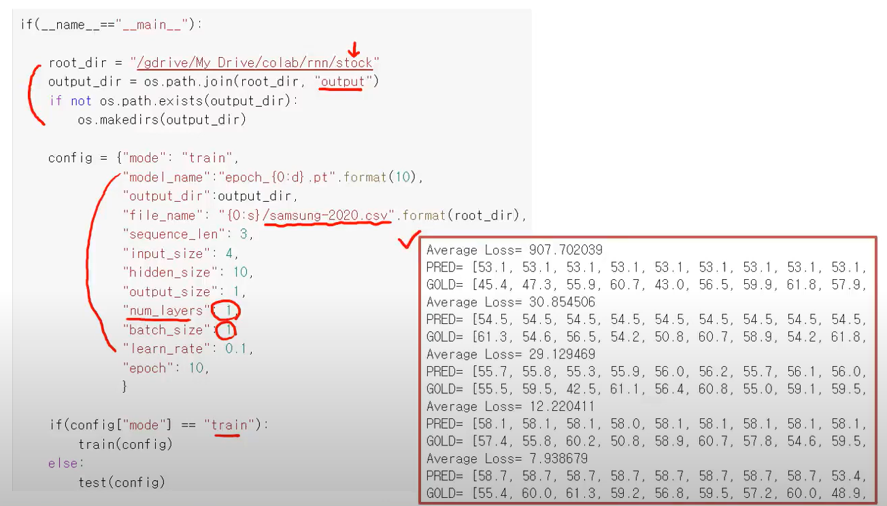

  

- ##### Many to Many Model (Sequence Labeling)

  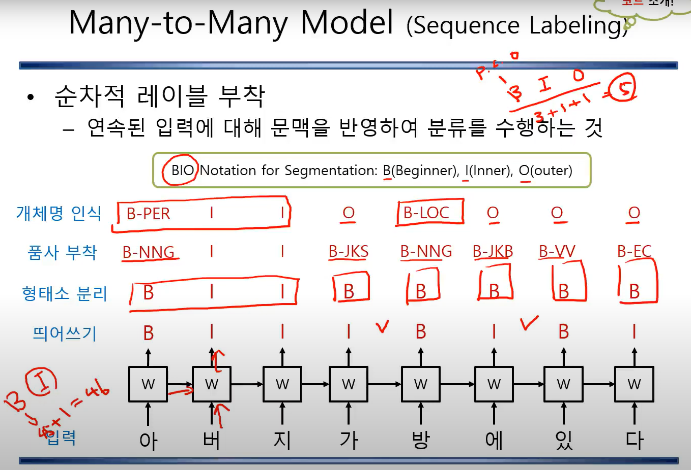

  - **Input, Output** 모두 `sequence`
    - 출력은 `Label Sequence`
  - 순차적 레이블 부착
    - 연속된 입력에 대해 문맥을 반영하여 분류를 수행하는 것
  - **RNN**구조로 해결 가능
  - **Segmentation (분할)**에선 **BIO Notation**을 쓰면 됨
    - `B` - Beginner
    - `I` - Inner
    - `O` - Outer

  - ##### 형태소

    - 의미를 가진 최소 단위

  - ##### 품사 부착

    - 기존의 형태소 분리에서 `B`로 표현 했던 것을 `B-NNG, B-JKS`로 표현
    - 여기서 Notation 수가 `BIO`에서 `BI` 총 2개였는데 품사를 부착하므로 품사 개수만큼만 늘어나면 됨
      - 한국어 품사가 45개면 `B = 45, I = 1` 개수 이므로 총 `46`개의 레이블로 해당 문제를 풀이 가능

  - ##### 개체명 인식

    - `B`가 `Person`이냐 `Location` 이냐 `Organization` 라는 것을 찾는 것
      - 아버지 - > `아` -`B-PER`, `버` - `I`, `지` - `I`
      - 가 -> `O`
      - 방 -> `B-LOC`
    - 개체명이 아닌 것은 `O`

- ##### Many to Many Model (Language Model)

  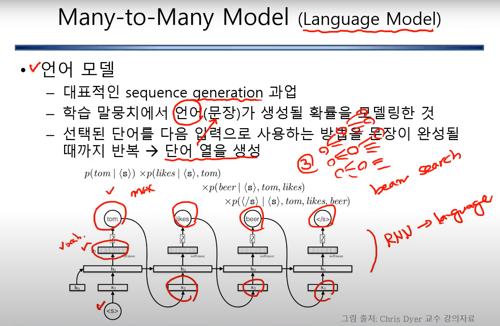

  - ##### 언어 모델

    - 대표적인 `sequence generation` 과업

      - 어떤 것들을 순차적으로 생성하는 것

    - 학습 말뭉치에서 언어(문장)가 생성될 확률을 모델링한 것

    - 선택된 단어를 다음 입력으로 사용하는 방법을 문장이 문장이 완성될 때까지 반복 -> **단어 열 (문장)**을 생성

      - 어떤 하나를 주면 그 단어를 바탕으로 그 다음 단어를 만들고 그 다음에는 앞에 있는 두 단어를 바탕으로 다음 단어를 만들어 하나의 문장이 될 때까지 반복하는 것

    - 과정

      - `s`를 넣어줬을 때 학습된 것을 바탕으로 `분포`를 만들거임
      - 그 중 하나를 가져오고 그 다음에 단어를 넣으면 문장을 생성할 수 있는 거임
      - 가장 큰 `max`를 가져오면 하나의 문장만 완성됨
      - 따라서, 가장 큰 `n`개를 가져와 계속 엮어서 계속해서 다른 문장을 만들 수 있음

    - ##### beam search

      - 가장 큰 `n`개의 단어를 가져와 단어끼리 엮어서 같은 문장이 아닌 다른 문장을 만드는 방법
      - 물론 여기서도 계속해서 가장 큰 값만 가져오면 만들어지는 문장이 한정될 수 있음
        - 이러한 문제를 해결하기위해 중간중간에 다른 기술들을 써서 다르게 나오게 할 수 있음

- ##### Many to Many Model (Sequence to Sequence)

  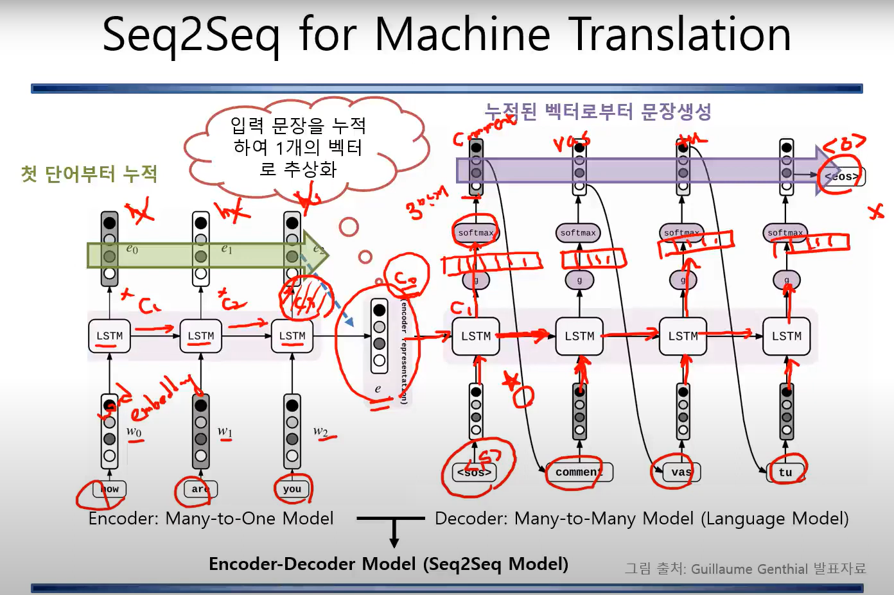

  - **NMT (Nerual Machine Translation**) 이라고도 함

  - **Encoder-Decoder Model (Seq2Seq Model)** 이라고 부름

  - `입력`에서는 `output`을 내뱉지 않음

    - 입력이 마지막까지 도달하면 그 다음부터는 `output`이 다시 `Sequence`형태로 출력이 됨
    - 즉, 마지막 입력부터 출력이 생성됨

  - **기계 번역**에서 가장 많이 쓰임

    - 한국어 문장이 들려오면 영어 문장으로 내뱉는 구조

  - **챗봇**도 같은 구조임

    - 질문이 들어오면 응답으로 내뱉는 구조

  - 단어 하나하나가 벡터로 되어있는 것을 `Word embedding`

  - 이 값들을 `LSTM`에 하나씩 들어옴

    - output을 내는 건 아님

  - 입력 문장을 넣으면서 계속해서 누적하여 1개의 벡터로 추상화

    - 마지막 컨텍스는 앞에서부터 누적된 단어를 통해 전체의 의미를 가진 state라고 가정
    - 단어가 각각 출력이 되는게 아니고 값을 계속해서 누적시킴

  - 해당 과정까지가 **Encoder : Many to One Model**

  - 이 다음부터 **누적된 1개의 벡터**를 **C(0)**로 설정

    - **C(0)**는 입력된 것의 마지막 값

  - **Decoder**의 **시작 값**으로는 특정 단어를 줌

    - 이 단계부터는 단어를 만들어 문장을 만들어 내라는 임베딩 값을 주는 것

    - ##### SOS **(Start of Sentence)**

      - 이러한 임베딩을 주고 **기존의 컨텍스트(입력의 마지막 값)** 을 줘서 `LSTM`을 수행

    - 그려면 **c(1)**의 **LSTM**은 무슨 역할을 수행?

      - 출력을 내뱉는데 출력은 사이즈가 **차원 (dimension)**이 얼마큼 되는 거냐면 여기는 우리가 생성하고자 하는 사전 수만큼의 **차원 (dimension)**
        - 예를 들어, 3만개의 사전이면 3만개의 차원이고 그 중에 하나를 이제 하나의 단어를 선택하는 형식
      - 학습할 때는 `One-hot`으로 정답을 주고 **예측 (prediction)**할 때는 해당 값이 나오면 그 값을 **softmax**하여 하나의 단어를 선택 -> **softmax**의 **argmax ** 값 

    - 이제 여기서 softmax의 argmax로 **출력된 단어의 값**을 그 다음의 **입력**으로 사용 (중요)

    - 그 다음에 또 그 전의 이전 cell-state가 들어감

    - 이렇게 반복하다 더 이상 문장을 만들어 낼 수 없다 라는 단어가 사전에 존재함

      - 그것을 **EOS (End of Sentence)** 
      - 해당 단어를 뽑으면 문장을 생성하고 마무리가 됨

  - 요약하면

    - 입력이 들어왔을 때 입력 문장을 누적해서 1개의 벡터로 추상화하고 추상화 된 벡터를 바탕으로 단어를 생성해나가는 과정
    - **Encoder** : 단어 각각에 대한 의미를 만들어 내는 것
    - **Decoder** : 인코딩 된 것을 이용해서 문장을 만들어 내는 것이기 때문에 출력의 기능을 함  

